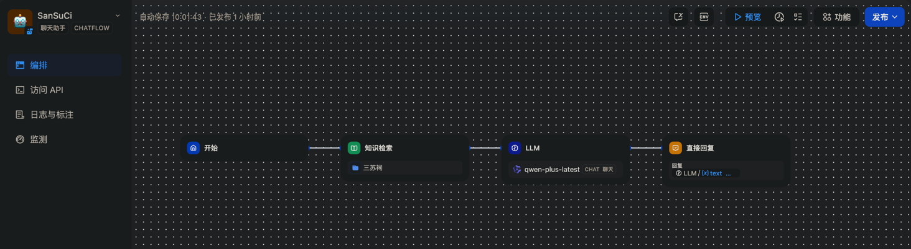

# Digital_Human_Tour_Guide
数字人导游，以三苏祠为例

# 项目简介
本项目以三苏祠为例，实现数字人导游功能，包括语音识别、语音合成、语音对话、语音交互等功能。

# 依赖项目
- [dify](https://github.com/langgenius/dify)
- [awesome-digital-human-live2d](https://github.com/wan-h/awesome-digital-human-live2d)

# 实现步骤
1. 部署awesome-digital-human-live2d项目
```
step1:
git clone https://github.com/wan-h/awesome-digital-human-live2d.git

step2:
cd awesome-digital-human-live2d

step3:
下载三苏祠图片，添加图片到awesome-digital-human-live2d/web/public/backgrounds目录下并在awesome-digital-human-live2d/web/app/lib/live2d/lappdefine.ts中修改字段BackImages添加图片名称即可

step4:启动容器
# 项目根目录下执行
docker-compose up --build -d
```

2. 部署dify项目
```shell
setp1:
git clone https://github.com/langgenius/dify.git

step2:
cd dify
cd docker
cp .env.example .env
docker compose up -d
```

3. 在dify搭建对话流程


4. 示例知识库文件
- [三苏祠知识库](./assets/三苏祠.docx)

# 效果展示
<video width="640" height="360" controls>
  <source src="./assets/demo.mp4" type="video/mp4">
</video>